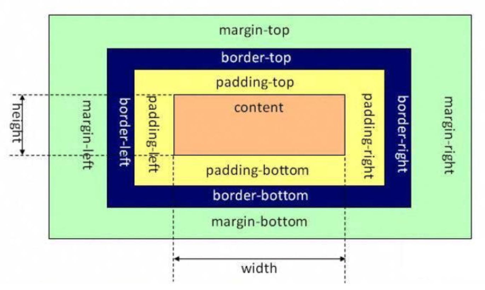
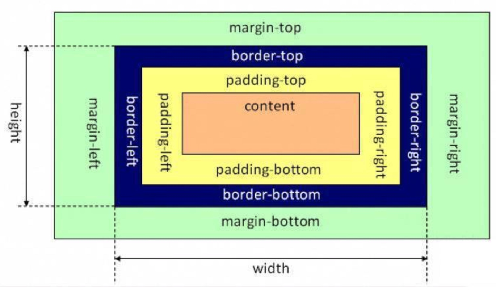

## 1.盒模型，普通盒模型和怪异盒模型有什么区别
一、标准盒子模型（W3C标准模式）

在标准模式下，width和height的内容区域就是content的width和height
一个块的总宽度 = margin(左右)+padding(左右)+border(左右)+width

二、怪异盒模型(IE盒子模型)

在IE盒模型中，width和height的内容区域除了content本身外还包括padding和border
一个块的总宽度=width+margin(左右) （width已经包括padding+border）

**1.如何运用**
在文档首部加入DOCTYPE标签，如果不加，则会由浏览器自己决定。

**2.怪异盒模型**
CSS3中的box-sizing

```css
    box-sizing:content-box || border-box || inherit || initial
```

当属性值为content-box时为标准盒模型
当属性值为border-box时为怪异盒模型