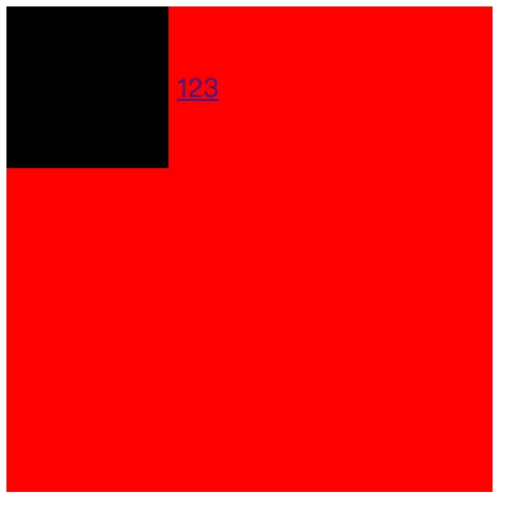
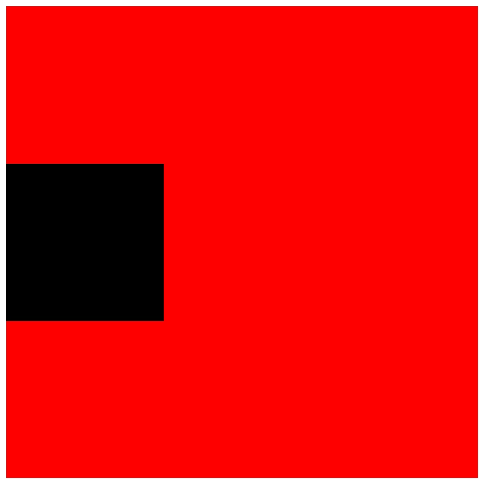
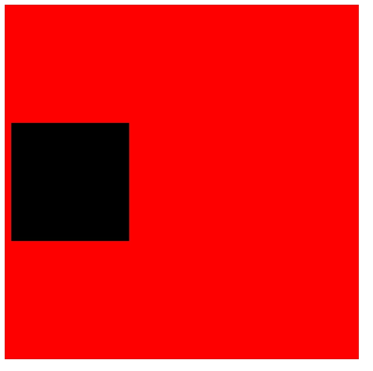
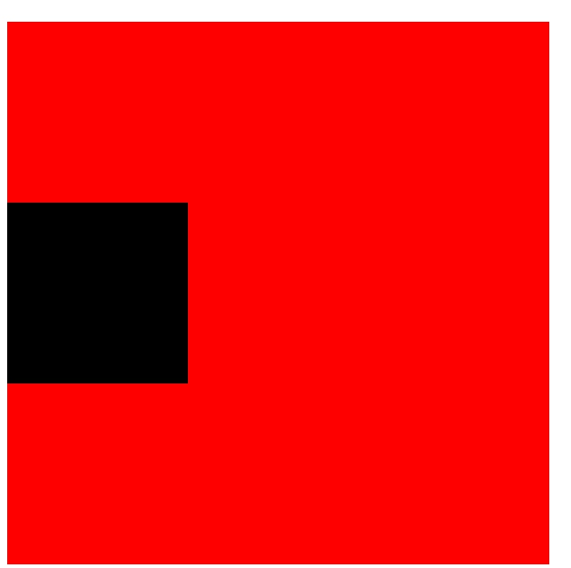

## 5.CSS如何实现垂直居中？
* 1.vertical-align:middle 
生效的前提是元素的display:inline-block 行内元素
在使用vertical-align:middle时需要一个兄弟元素做参照物，让它垂直于兄弟元素的中心点。

```css
  #box{
    width: 300px;
    height: 300px;
    background-color:red;
  }
  #a{
    vertical-align: middle;
  }
  #content{
    width: 100px;
    height: 100px;
    background-color: black;
  }
```        

* 2.display:flex
```css
  #box{
    width: 300px;
    height: 300px;
    background-color:red;
    display: flex;
    align-items: center;
  }
  #content{
    width: 100px;
    height: 100px;
    background-color: black;
  }
```

```css
  #box{
    width: 300px;
    height: 300px;
    background-color:red;
    display: flex;
  }
  #content{
    width: 100px;
    height: 100px;
    background-color: black;
    align-self: center;
  }
```


* 3.通过伪元素:before实现CSS垂直居中
```css
  #box{
    width: 300px;
    height: 300px;
    background-color:red;

  }
  #box::before{
    content: '';
    display: inline-block;
    vertical-align: middle;
    height: 100%;
  }
  #content{
    width: 100px;
    height: 100px;
    background-color: black;
    display: inline-block;
    vertical-align: middle;
  }
```

* 4.position:relative
```css
  #box{
    width: 300px;
    height: 300px;
    background-color:red;
  }
  #content{
    width: 100px;
    height: 100px;
    background-color: black;
    position: relative;
    top: 50%;
    transform: translateY(-50%);
  }
```

```css
  #box{
    width: 300px;
    height: 300px;
    background-color:red;
    position: relative;
  }
  #content{
    width: 100px;
    height: 100px;
    background-color: black;
    position: absolute;
    top: 50%;
    transform: translateY(-50%);
  }
```

