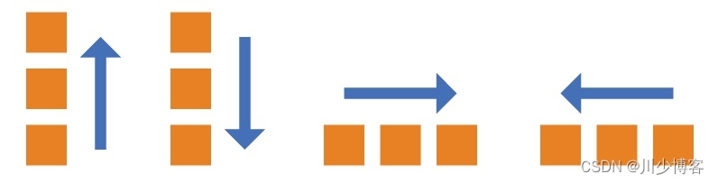
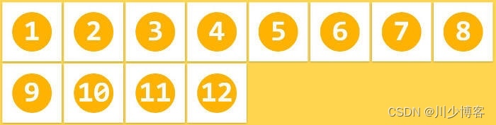
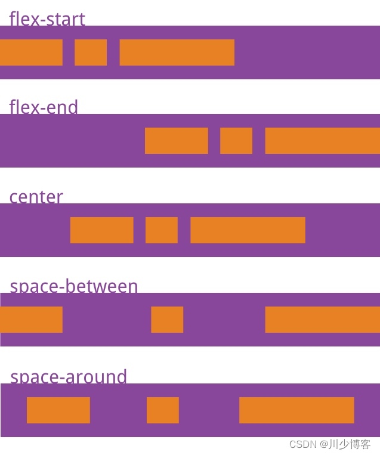
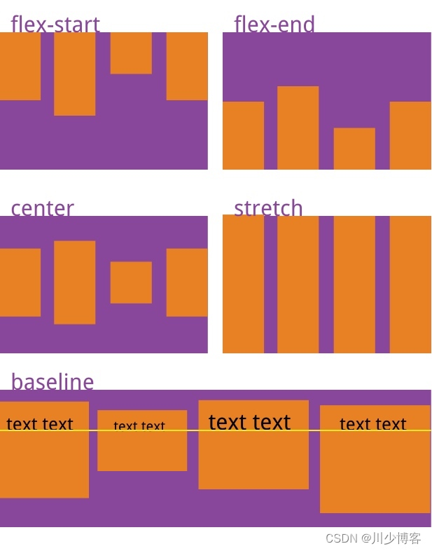
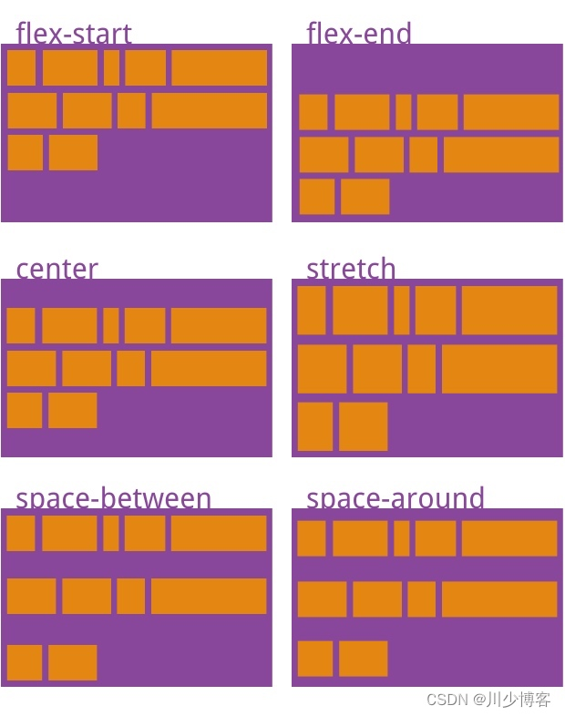

## 9.flex弹性盒模型
1.flex-direction:决定主轴的方向，即项目的排列方向
row(默认，水平方向，起点在左侧)
column(垂直方向，起点在上方)
row-reverse
column-reverse

2.flex-wrap:决定一条轴线排不下该如何换行
nowrap(默认，不换行)

wrap(换行，第一行在上面)

wrap-reverse(换行，第一行在下面)

3.justify-content:定义了项目在主轴上的对齐方式
flex-start(默认，左对齐)
flex-end(右对齐)
center(居中)
space-between(两端对齐)
space-around(每个项目两侧的间隔相等)

4.align-items:定义项目在交叉轴上如何对齐
flex-start(交叉轴起点对齐)
flex-end(交叉轴终点对齐)
center(交叉轴居中对齐)
baseline(项目的第一行文字的基线对齐)
stretch(默认值、占满整个容器高度)

5.align-content:定义了多个轴线的对齐方式，如果项目只有一个轴线，该项目不起作用
flex-start(交叉轴的起点对齐)
flex-end(交叉轴终点对齐)
center(交叉轴中点对齐)
space-between(交叉轴两端对齐，轴线之间的间隔平均分布)
space-around(每个轴线两侧的间隔都相等)
strech(默认值，占满整个交叉轴)
