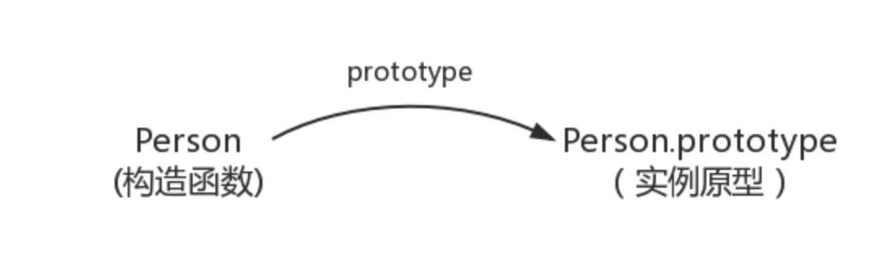
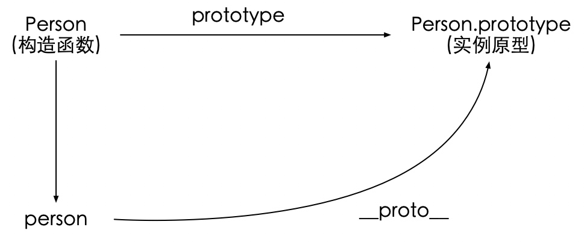
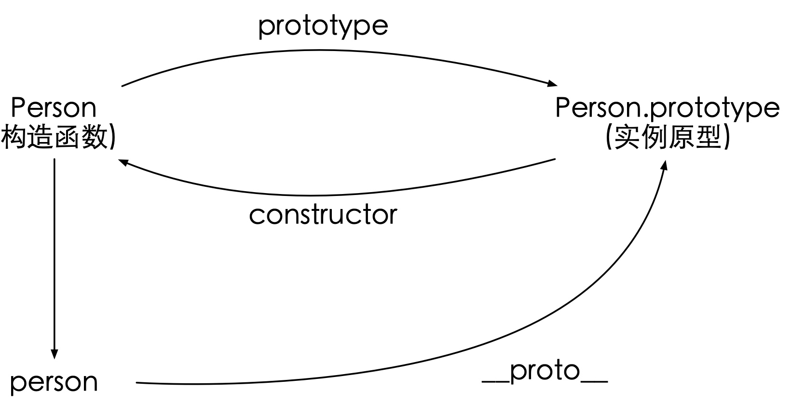
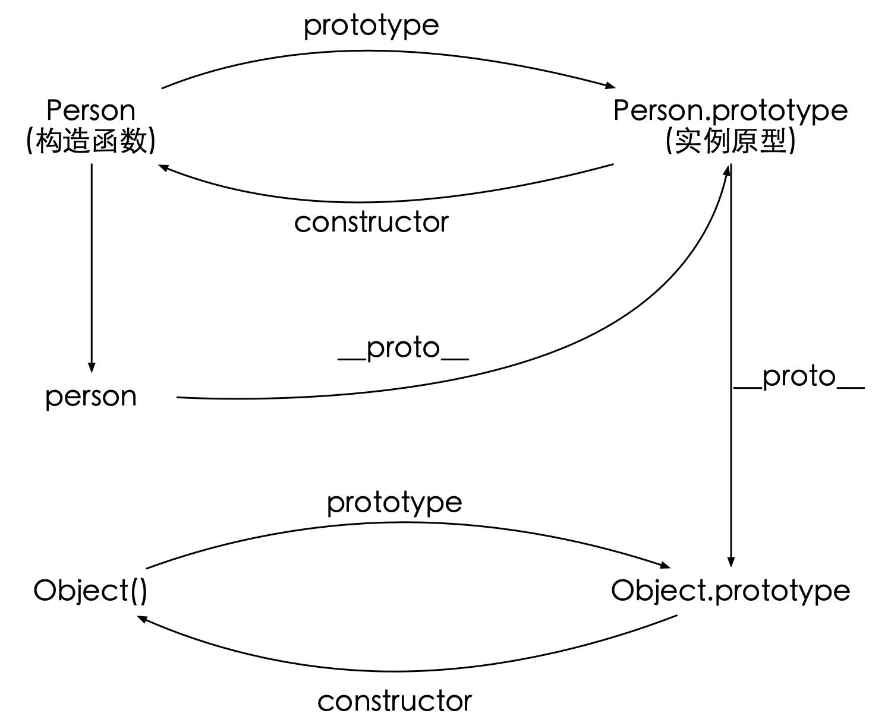
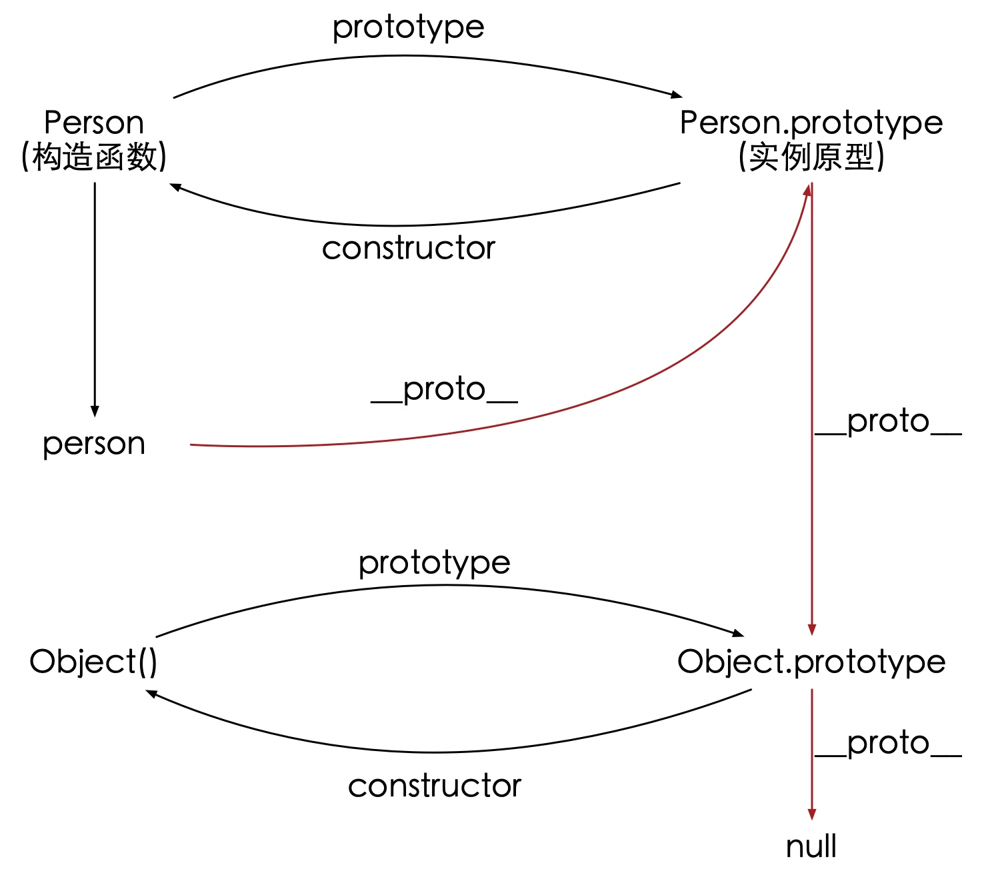

## 1.原型链
**原型**：被用于复制现有实例来生成新实例的函数
**构造函数**：用new来调用，就是为了创建一个自定义类
**实例**：是类在实例化之后一个一个具体的对象
**原型链**：每个构造函数都有一个原型对象，原型对象都包含一个指向构造函数的指针，而实例都包含一个指向原型对象的内部指针。

### 1.原型
js中每一个函数都有一个prototype属性，这个属性指向函数的原型对象，每一个由原型对象派生的子对象，都有相同的属性。子对象就叫做构造函数，从实例原型中获取相同的属性

```js
function Person(age){
    this.age = age
}

Person.prototype.name = 'liwenxuan'    

var person1 = new Person()
var person2 = new Person()
```


### 2. \_\_proto__
它是每一个值对象都会有的一个属性，指向该对象的原型

``` js
var person = new Person()

person.__proro__ == Person.prototype // true
```

此属性可以访问原型，但并不存在于Person.prototype中，来自于Object.prototype，可以理解为返回Object.getPrototypeOf(obj)

### 3.构造函数constructor
每个原型都有一个constructor属性，指向关联的构造函数
当获取person.constructor时，其实person中并没有constructor属性，当不能读取到constructor属性时，会从person的原型也就是Person.prototype中读取

```js
Person.prototype.constructor == Person // true
```



### 4.实例与原型
当读取实例的属性时，如果找不到，就会查找与对象关联的原型中的属性，如果还查不到，就去找原型的原型，一直找到最顶层位置

```js
function Person() {

}

Person.prototype.name = 'kevin'

var person = new person()

person.name = 'David'

person.name // David
delete person.name

person.name // kevin
```

### 6.原型链
每个构造函数都有一个原型对象，原型对象都包含一个指向构造函数的指针，而实例都包含一个指向原型对象的内部指针。那么假如让原型对象等于一个类型的实例，此时的原型对象将包含一个指向另一个原型的指针，相应的，另一个原型对象中也包含一个指向另一个构造函数的指针。假如另一个原型又是另一个类型的实例，那么上述关系依然成立。如此层层递进，就构成了实例与原型的链条。这就是所谓的原型链。


