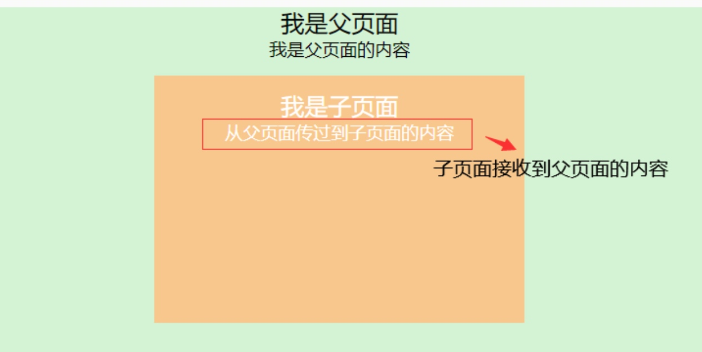
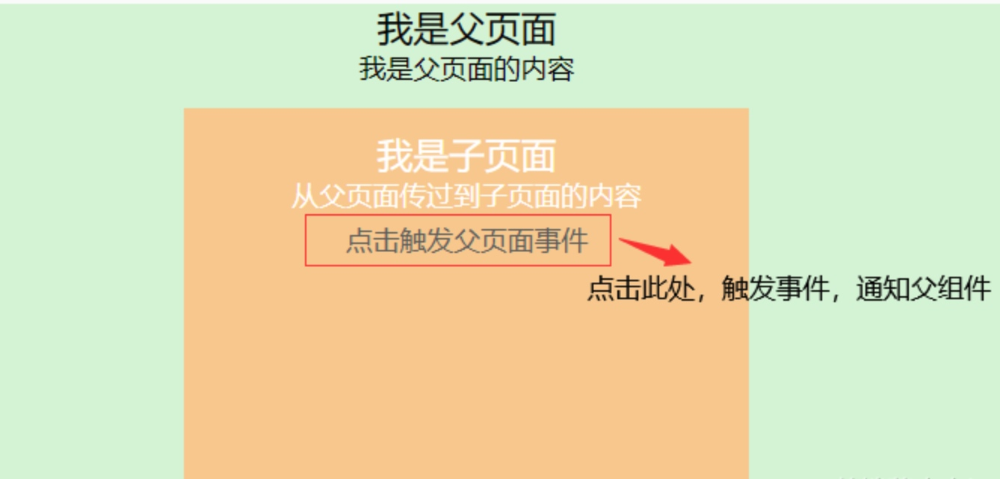
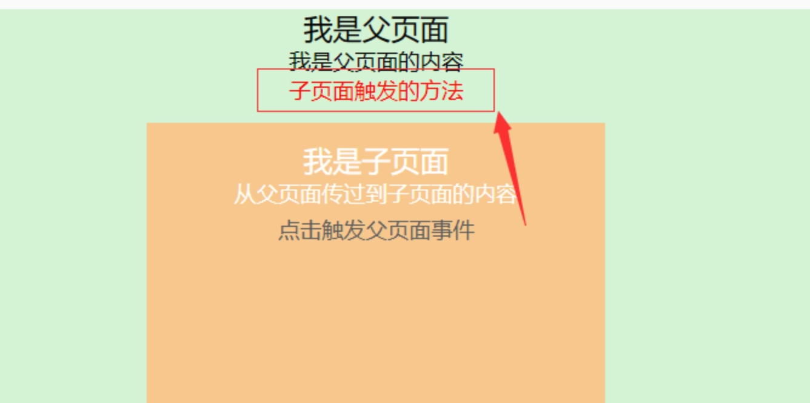

# 4.Vue组件间通信方式有哪些
### 1.父传子 Props
在父组件中用过`:message`向子组件通信

**父组件**
```js
<template>
    <div class="parent-box">
        <div>
            <div>我是父页面</div>
            <div>{{message}}</div>
        </div>
        <children :message="toChildrenMsg"></children> 
        // 传递给子组件的值message为父组件的toChildrenMsg
    </div>
</template>
 
<script>
import Children from './Children.vue'  //当前页引入子组件
export default {
    name:"Parent",
    components:{
        Children
    },
    data(){
        return {
            message:'我是父页面的内容',
            toChildrenMsg:'从父页面传过到子页面的内容'
        }
    }
}
</script>
```

**子组件**
在子组件通过props进行接收，注意子组件props里面接收的对象名称必须与父组件中在子组件绑定的名称一致，当前例子为message。

```js
<template>
    <div class="children-box">
        <div>
            <div>我是子页面</div>
            <div>{{message}}</div>
        </div>
    </div>
</template>
 
<script>
export default {
    name:"Children",
    props:{
        message:{
            type:String,  //类型判断
            default:''    //默认值
        }
    }
}
</script>
```

**效果图**


### 2.子传父（$emit）
在子组件中通过`this.$emit()`方法向父组件通信，如下，点击触发时间，执行`this.$emit('fromChildMethod')`，触发父组件的`fromChildMethod`方法

**子组件**
```js
<template>
    <div class="children-box">
        <div>
            <div>我是子页面</div>
            <div>{{message}}</div>
            <div><span @click="toParentMethod">点击触发父页面事件</span></div>
        </div>
    </div>
</template>
 
<script>
export default {
    name:"Children",
    props:{
        message:{
            type:String,
            default:''
        }
    },
    methods:{
        toParentMethod(){
            // 定义一个事件传递函数，当子组件的toParentMethod事件触发时，向父组件传递fromChildMethod事件
            this.$emit('fromChildMethod')
        }
    }
}
</script>
```

在父组件的子组件上绑定`fromChildMethod`方法，对该方法进行监听，当该方法触发时，执行父组件中相应的方法`fromChild`

```js
<template>
    <div class="parent-box">
        <div>
            <div>我是父页面</div>
            <div style="font-size:12px;">{{message}}</div>
            <div style="font-size:12px;color:red">{{fromChildMsg}}</div>
        </div>
        <children :message="toChildrenMsg" @fromChildMethod="fromChild"></children>
        // 当子组件传递过来fromChildMethod事件后，父组件触发fromChild事件
    </div>
</template>
 
<script>
import Children from './Children.vue'
export default {
    name:"Parent",
    components:{
        Children
    },
    data(){
        return {
            message:'我是父页面的内容',
            toChildrenMsg:'从父页面传过到子页面的内容',
            fromChildMsg:''
        }
    },
    methods:{
        fromChild(){
            this.fromChildMsg = '子页面触发的方法' //监听到子组件触发的方法，显示该内容
        }
    }
}
</script>
```

**ps**：父传子，props；子传父，this.$emit()；触发、监听名称须一致。



### 3.事件总线 EventBus
相当于一个全局的仓库，任何组件都可以去这个仓库里获取事件

#### 3.1 初始化
`Vue.prototype.$EventBus = new Vue()`

#### 3.2 向EventBus发送事件
**语法**：`this.$EventBus.$emit(事件名称,传递的参数)`
* **组件A**

```js
<template>
    <button @click="sendMsg">发送MsgA</button>
</template>

<script> 
export default {
  data(){
  	return{
  		MsgA: 'A组件中的Msg'
  	}
  },
  methods: {
    sendMsg() {
      /*调用全局Vue实例中的$EventBus事件总线中的$emit属性，发送事
      件"aMsg",并携带A组件中的Msg*/
      this.$EventBus.$emit("aMsg", this.MsgA);
    }
  }
}; 
</script>
```
#### 3.3 从EventBus接收事件
**语法**：`this.$EventBus.$on(事件监听名, 回调函数)`
* **组件B** 
```js
<template>

  <!-- 展示msgB -->
  <p>{{msgB}}</p>
  
</template>

<script> 
export default {
  data(){
    return {
      //初始化一个msgB
      msgB: ''
    }
  },
  mounted() {
    /*调用全局Vue实例中的$EventBus事件总线中的$on属性,监听A组件发送
    到事件总线中的aMsg事件*/
    this.$EventBus.$on("aMsg", (data) => {
      //将A组件传递过来的参数data赋值给msgB
      this.msgB = data;
    });
  }
};
</script> 
``` 

### 4. Vuex状态管理库

### 5. Router
可以通过动态路由、路由跳转方式进行传值，如`this.router.push({path:'xxx', query:{value:'value'}})`,在跳转的时候顺便传值，通过`this.$route.params.value`和`this.$route.query.value`获取到传过来的参数。该方式有局限性，只能在相互跳转的组件通信取值，且直接在跳转之后的页面进行刷新取不到值。

### 6. 缓存
多个组件之间的通信除了可以用`EventBus | store`之外，还有一种常用的方式——缓存，在同一个窗口不关闭的情况下，该窗口下的其他组件都可以取到缓存中已经存好的值，利用`sessionStorage.setItem(key,value),localStorage.setItem(k,value)`等将值存起来，其他组件可以通过`sessionStorage.getItem(key),localStorage.getItem(key)`等方式拿到，多个页面共享缓存数据，刷新页面数据不会销毁，可以用`sessionStorage.removeItem(key),localStorage.removeItem(key)`的方式将缓存移除。