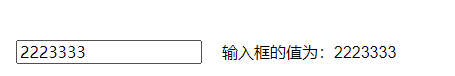

# 5.computed和watch区别
### 1. 总述
* computed和watch都是vue中用于监听数据变化的属性

### 2. computed计算属性
* 如果函数所依赖的属性没有发生变化，从缓存中读取
* 必须有return返回
* 使用方法和data中的数据一样，是类似一个执行方法

### 3. watch监听器
* watch的函数名必须和data中的数据名一致
* watch中的函数有两个参数，新旧
* watch中的函数是不需要调用的
* 只会监听数据的值是否发生改变，而不会监听数据的地址是否发生改变，要深度监听需要配合`deep:true`属性使用
* `immediate:true`页面首次加载的时候做一次监听

### 4. 区别
* **功能**：computed是计算属性，watch是监听一个值的变化而执行对应的回调
* **是否调用缓存**：computed函数所依赖的属性不变的时候会调用缓存；watch每次监听的值发生变化的时候都会调用回调
* **是否调用return**：computed必须有；watch可以没有
* **使用场景**：computed当一个属性受多个属性影响的时候：例如购物车商品结算；watch当以一条数据影响多条数据的时候：例如搜索框
* **是否支持异步**：computed函数不能有异步；watch可以。

### 5. watch的直接监听

```js
<input type="text" v-model="inputValue"> 输入框的值为：{{watchInputValue}}

export default {
    data(){
        return {
            inputValue: '',
            watchInputValue: ''
        }
    },
    watch: {
        inputValue(newName, oldName){
            this.watchInputValue = newName
        }
    }
}
```

```js
<input type="text" v-model="inputValue">
输入框的值为：{{watchInputValue}}

export default {
    data(){
        return {
            inputValue: '',
            watchInputValue: ''
        }
    },
    watch: {
        inputValue：{
            handler(newName, oldName){
                this.watchInputValue = newName
            }
        }
    }
}
```



