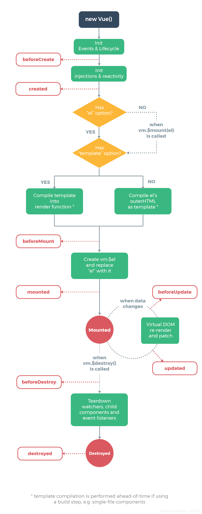

# 7. Vue生命周期

### 1.初始化阶段
* **beforeCreate**：实例刚创建完成，此时还没有data和methods属性
* **created**：vue实例data和method属性已经初始化完成，此时还没有编译模板

### 2.实例挂载阶段
* **beforeMount**：挂载前，模板编译完成，此时el还没有挂载，data目前可见。
* **mounted**：挂载完成后，模板编译完成，el挂载完成

### 3.数据更新阶段
* **beforeUpdate**：数据更新时执行，data数据此时已经是最新的数据，UI界面还是旧的
* **updated**：数据更新完成后，界面的data里的数据此时都是最新的，完成的界面的更新渲染render

#### 4.销毁阶段
* **beforeDestory**：实例准备销毁，此时data和methods方法都能用
* **destroyed**：实例销毁完成，此时原先创建的实例方法和属性都不可以使用